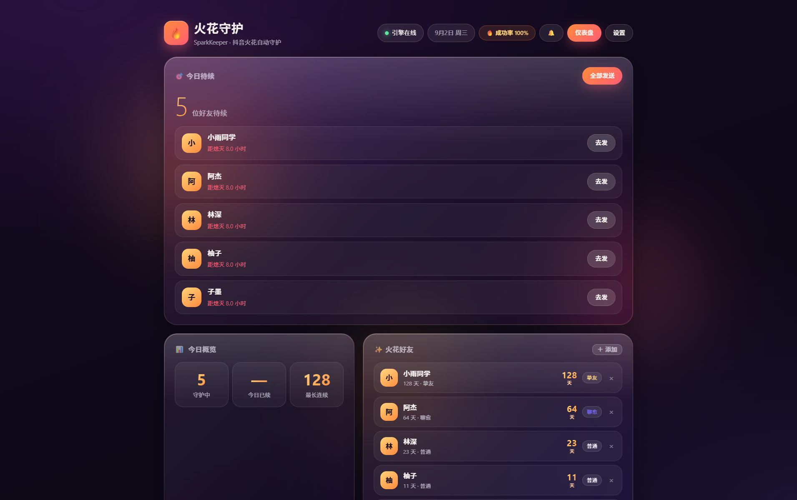
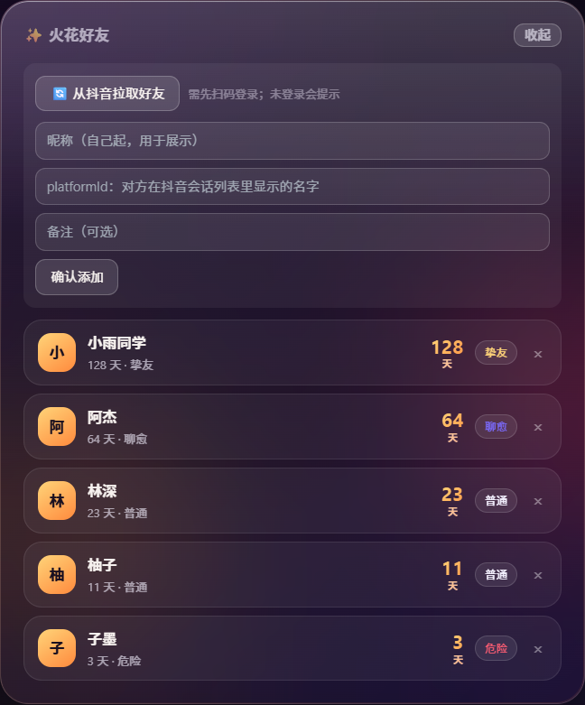
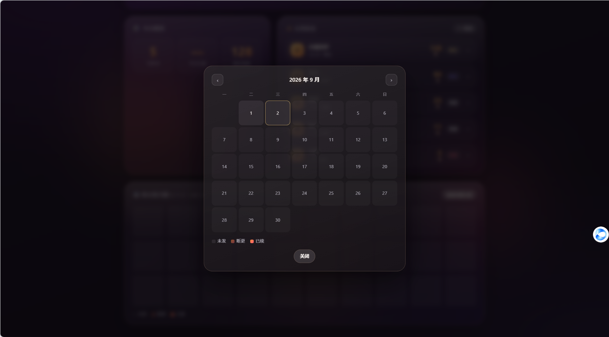
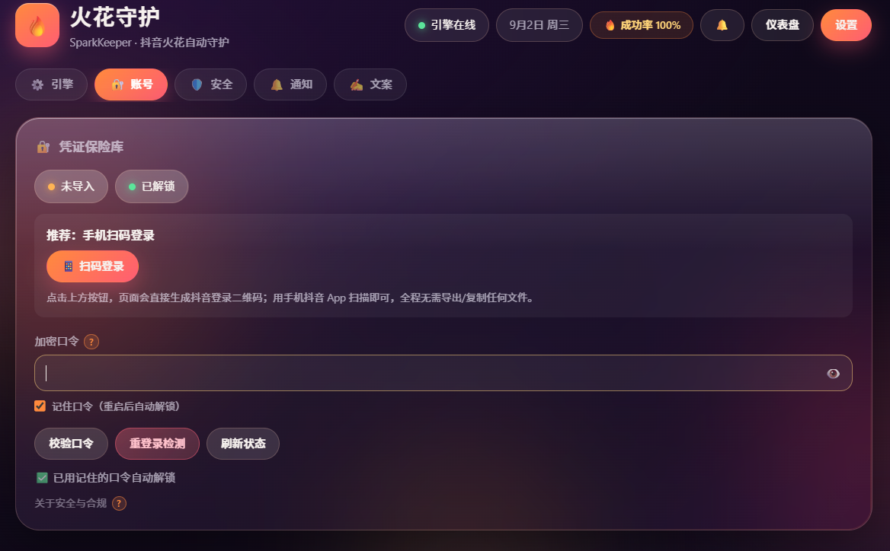

# 🔥 抖音火花守护 · SparkKeeper

> **在你自己的电脑上，安静地替你守住每一段关系。**
>
> 一个自带可视化看板的抖音「火花」自动续火工具：扫码登录、勾选好友、之后全自动。
> 凭证本地加密、零遥测、开源可审计。

[](./LICENSE)
[](https://nodejs.org/)
[](https://playwright.dev/)
[]()

---

## 📸 效果预览

> ⚠️ **这是本项目最值得看的部分。**
> 市面上同类工具都是"跑完就没了"的命令行脚本，**SparkKeeper 是唯一一个带实时看板的**：
> 今天发给谁、连续多少天、火花还剩多久熄灭、成功率多少——一眼看完。

| 仪表盘（液态玻璃） | 好友与连续天数 |
| :---: | :---: |
|  |  |

| 续火日历热力图 | 设置与文案模板 |
| :---: | :---: |
|  |  |

<details>
<summary>看板都能看到什么？</summary>

- **今日待续（顶部主角）**：还差谁没发、还剩几小时，一键全发
- **今日概览**：守护了几个好友、今天发了几条、最长连续几天
- **火花好友**：每个人的连续天数 + 等级（支持从抖音会话一键拉取勾选）
- **续火热力图**：近 30 天 3×10 网格一眼扫完，点开是**按月翻页的月历**
- **顶部常驻**：30 天发送成功率 + 异常通知铃铛（掉线/验证码/失败主动提醒）

</details>

---

## 🤔 为什么又造一个轮子？

GitHub 上已经有很多"抖音自动续火花"的项目了。它们的**发送原理都一样**（Playwright 模拟人工操作），但绝大多数长这样：

> 改配置文件 → 等定时任务 → 跑完退出 → **不知道成功没有、不知道断了几天**

SparkKeeper 想解决的是后面那一半：**让你看得见、管得住**。

| | 常见脚本类项目 | **SparkKeeper** |
| :--- | :--- | :--- |
| 有没有界面 | ❌ 只有配置文件 | ✅ **实时液态玻璃看板** |
| 运行状态 | ❌ 跑完才知道，失败静默 | ✅ **看板实时可见 + 失败自动截图存证** |
| 演练能力 | 部分有（只生成文案） | ✅ **Dry Run 真开浏览器验证，不发消息** |
| 凭证存放 | 明文 `.env` / 云端 Secrets | ✅ **本机 AES-256-GCM 加密，明文不落盘** |
| 风控保护 | 随机延迟 | ✅ **随机延迟 + 错峰窗口 + 每日上限 + 熔断** |
| 文案 | 固定套话 / 一言 API | ✅ **可自定义模板 + 变量注入（昵称/星期/天气/语气）** |
| 多平台扩展 | ❌ 写死 | ✅ **PlatformAdapter 接口，微信/Telegram 可插拔** |
| 协议 | 多为非商业许可 | ✅ **MIT** |

---

## 🚀 30 秒上手

<details>
<summary><b>方式一：Docker（需要你本机已装 Docker）</b></summary>

```bash
git clone https://github.com/DKXaiLBY/SparkKeeper.git
cd SparkKeeper
docker compose up -d --build
# 打开 http://localhost:3000
```

> 📌 **诚实说明**：Docker 这条路径**做过静态审查并修复了已知问题**（缺 `.dockerignore` 会把含凭证的
> `server/data/` 打进镜像、容器内缺少 Playwright/Chromium 导致抖音模式不可用），
> 但**开发者的开发环境没有 Docker，因此未做真机运行验证**。
> **推荐优先用下方的本机运行方式**（那条路径是完整验证过的）。
> 如果你用 Docker 跑通了、或修好了其中的问题，非常欢迎提 PR —— 感谢！

</details>

<details open>
<summary><b>方式二：本机运行（Windows / macOS / Linux）</b></summary>

```bash
git clone https://github.com/DKXaiLBY/SparkKeeper.git
cd SparkKeeper
npm run install:all
npm run dev:server   # 终端 1：后端 :3000
npm run dev:web      # 终端 2：前端 :5173
```

浏览器打开 **http://localhost:5173**，然后：

1. 点「扫码登录」→ 手机扫一下
2. 勾选要续火花的好友
3. 完成 ✅

</details>

> ⚠️ **要用真实抖音模式，必须先装 Playwright**（只玩 mock 演示模式则不需要）：
> ```bash
> npm i playwright && npx playwright install chromium
> ```
> 项目对它是**按需加载**，所以不装也能正常跑演示；但不装的话——扫码能成功、
> **发送时会报「未安装 playwright」**。提前装好，别等到发送失败才发现。

> Windows 用户也可以直接双击 `启动.bat`（自动装依赖、起服务、开浏览器），`停止.bat` 关闭。

---

## ✨ 核心特性

**🔐 本地优先，凭证不出本机**
- 登录态用 **AES-256-GCM** 加密存本地（PBKDF2 派生密钥），明文只在内存里
- **零遥测**：不收集任何数据，所有网络请求只有「发消息」这一件事
- 开源可审计，你看得见每一行代码

**📊 看得见的运行状态**
- 实时看板：连续天数、成功率、待办、日历热力图
- 失败自动截图存证（存到 `data/screenshots/`），卡在哪一步一目了然
- 登录态失效 / 验证码 / 发送失败都会主动提醒，不会静默断火

**🧪 Dry Run 真的会演练**
- 不是只生成一句文案就完事——它会**真的打开浏览器**，验证「能不能找到这个好友、能不能找到输入框、能不能找到发送按钮」，但**绝不点发送**
- 换手机、换网络、抖音改版之后，先跑一次 Dry Run 心里就有数

**🛡️ 安全模式（默认开启）**
- 随机延迟 30–180 秒、每日发送上限、错峰窗口（默认晚 19–22 点）
- 连续失败自动**熔断**暂停，不会一直硬发
- 三档预设可选：保守 / 推荐 / 激进

**✍️ 文案你自己说了算**
- 自定义模板，支持变量：`{nickname}` `{weekday}` `{weather}` `{mood}`
- 不接 AI 也能用，接了（自带 Key）可以更自然
- 告别"今日火花 +1 🔥"这种一眼假的套话

**🧩 架构干净**
- 发送逻辑与平台**完全解耦**（`PlatformAdapter` 接口）
- 当前实现：抖音网页版 + Mock 演练适配器
- 以后接微信 / Telegram，不用动核心代码

---

## 🔒 安全与隐私

| 问题 | 回答 |
| :--- | :--- |
| 我的密码 / Cookie 会传到哪里吗？ | **不会**。凭证只加密存在你自己电脑上，代码里没有任何上报逻辑 |
| 为什么要我的登录态？ | 程序要在抖音网页版"以你的身份"发消息，必须有登录态。扫码登录后由程序自行加密保存 |
| 别人能访问我的后台吗？ | 默认只监听 `127.0.0.1`（仅本机可访问），局域网其他设备访问不了 |
| 会不会偷偷发消息？ | 不会。所有发送行为都记录在看板上，可随时暂停/接管 |

---

## ❓ 常见问题

**Q：火花等级 / 天数是从抖音读的吗？**
不是。本项目的连续天数来自**自己的发送记录**——只要你每天都成功发出去，火花就不会断。读取抖音的火花数据需要碰逆向接口，风险高且不稳定，我们不做。

**Q：需要一直开着电脑吗？**
本机运行时需要（定时任务触发那一刻进程要活着）。你也可以部署到一台小 VPS 上，24 小时跑。

**Q：登录态会过期吗？**
会，一般几周到几个月不等。过期后顶部铃铛会提醒你，重新扫码即可。通知通道（Webhook / Telegram）打开后，掉线第一时间推送。

**Q：支持多账号吗？**
当前版本只支持单账号。

---

## ⚠️ 风险与免责声明（请务必读完再用）

> 使用自动发送私信**可能违反《抖音用户服务协议》及社区公约**（不违法，但属于违约行为），
> 由此产生的账号风控、功能限制、甚至封号等**一切风险由使用者自行承担，开发者不承担任何责任**。

**本项目为开源学习用途，仅用于技术研究和个人自用。严禁用于：商业用途、批量营销、多账号矩阵运营、对外提供服务。** 若你使用本项目即表示已阅读并同意本免责声明；如不同意，请立即停止使用。

我们采取的是**降低风险**的思路，而不是绕过平台限制：

1. **不绕过验证码**：检测到验证码会主动暂停并提醒你人工处理
2. **不破解协议**：只用 Playwright 模拟人工操作官方网页版，不涉及逆向接口、不破解、不入侵抖音系统
3. **不做批量营销**：所有参数默认保守（少好友、低频率、拟人节奏）

**建议**：好友控制在个位数、每天只发 1 条、内容别重复。用得越克制，活得越久。

**关于"抖音"名称**：本项目的"抖音"仅用于描述兼容的平台（与 DouYinSparkFlow 等同类的开源惯例一致），非商用、无官方授权；项目不包含任何抖音商标素材、logo 或官方接口。

如果你不接受任何风险，请不要使用本项目。

---

## 👥 适合谁 / 不适合谁

✅ **适合**
- 想保住火花但总忘记发的普通用户
- 有隐私洁癖、不想把 Cookie 传到别人服务器的人
- 想看得见运行状态、不喜欢"跑完不知道结果"的人

❌ **不适合**
- 想批量群发、做营销的人（本项目明确不支持）
- 想多账号矩阵操作的人（当前不支持）
- 需要读取抖音官方火花数据的人（本项目不做）

---

## 🛠 技术栈

| 层 | 选型 |
| :--- | :--- |
| 前端 | React 18 + Vite + TypeScript，液态玻璃 UI 为原生 CSS/SVG（零 UI 框架，`web/src/lib/glass.css`） |
| 后端 | Node + Express + TypeScript + better-sqlite3 + node-cron |
| 自动化 | Playwright（Chromium） |
| 加密 | Node 内置 `crypto`（AES-256-GCM + PBKDF2），零第三方依赖 |
| 部署 | Docker 多阶段构建 / 本机直跑 |

完整架构设计见 [architecture.md](./architecture.md)，生态与合规调研见 [research-report.md](./research-report.md)。

---

## 📄 License

[MIT](./LICENSE)

> ⭐ 如果这个项目对你有用，点个 Star 就是最大的支持 —— 这也是我继续维护它的动力。
