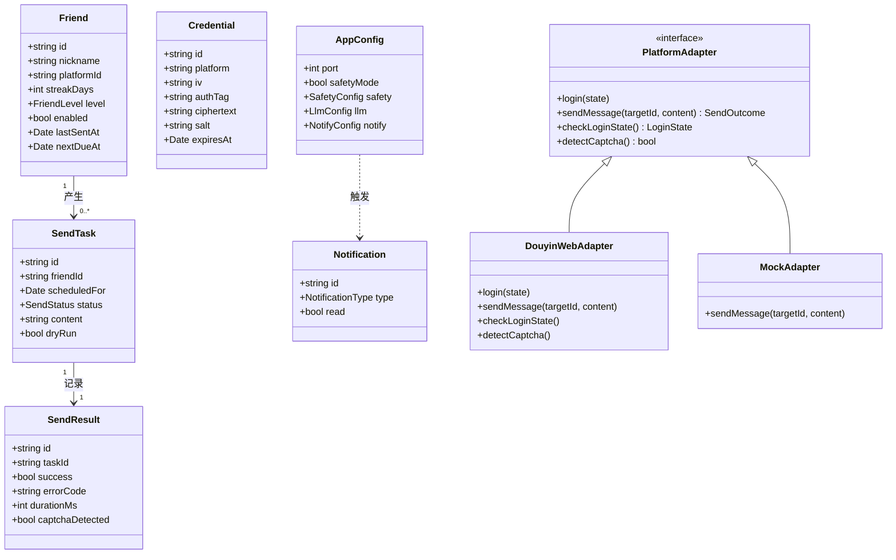
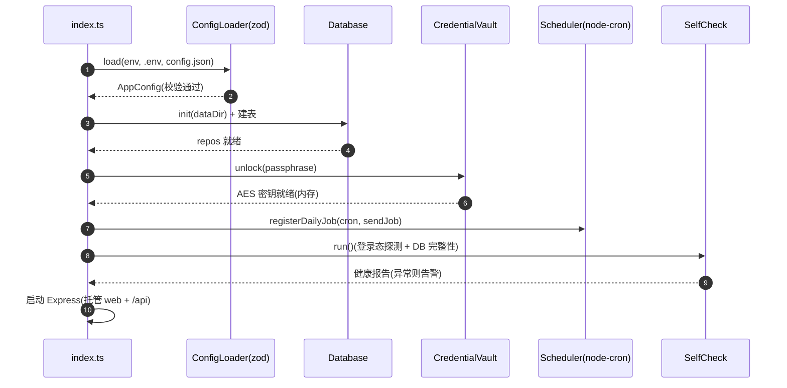
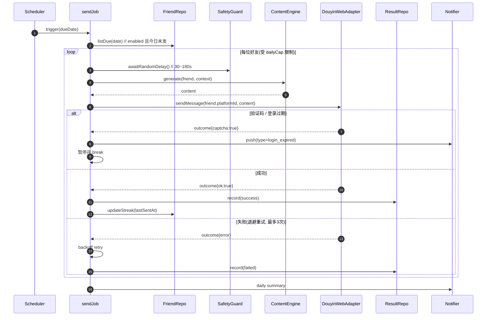
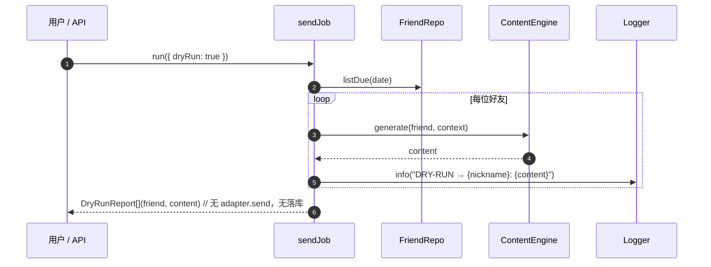
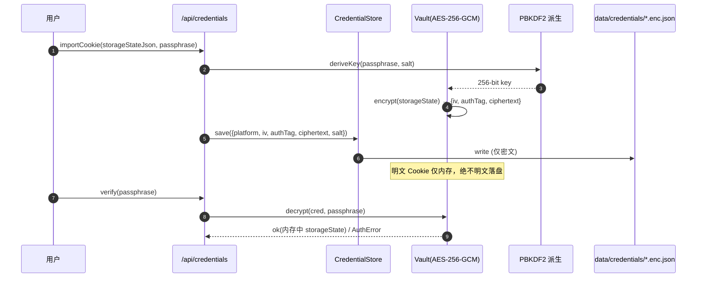

# 抖音火花守护 · 系统架构设计

> 作者：架构师「高见远」｜ 形态：Web 应用（液态玻璃仪表盘 + Node 后端服务）｜ 协议：MIT｜ 部署：Docker 自托管、跨平台
> 配套文档：`research-report.md`（生态/合规调研）、`dashboard-concept.html`（UI 概念稿）
> 本文只做**设计 + 任务分解**，不含实现代码。

---

## 1. 实现方案与框架选型

### 1.1 核心难点（从调研提炼）

| 难点 | 说明 | 应对策略 |
|---|---|---|
| 登录态易过期 + 验证码 | Cookie 数天~数周过期；异地/机房 IP 风控；验证码弹窗需人工处理 | 本地 AES 加密存储；登录态心跳探测；**验证码/过期只主动推送、不自动绕过**（合规红线） |
| 平台 UI 易改版导致发送失败 | 抖音网页结构变动会打崩定位逻辑 | 发送逻辑与平台强解耦：`PlatformAdapter` 抽象，抖音实现独立为 `DouyinWebAdapter`，便于替换/插拔 |
| 发送行为被风控识别 | 固定文案、秒发、无延迟像机器人 | 默认**安全模式**：随机延迟(30–180s) + 每日上限(20人) + 错峰窗口；文案拟人化（模板/可选 LLM） |
| 开发环境无法真登录抖音 | 无法在 CI 内验证真实发送 | 发送引擎可独立单测；`Dry Run` 与真实发送**共用**文案生成与调度，仅最后一步 `adapter.send()` 不同 |
| 凭证安全 | Cookie≈账号密码，明文落盘极其危险 | 用户设口令 → PBKDF2 派生 → AES-256-GCM 加密 → 仅密文落盘；明文只驻留内存 |
| 跨平台交付 | 先 Windows 本机验证，再上 Linux VPS | 统一 Node 服务；Docker 多阶段构建；better-sqlite3 / Playwright 均有跨平台预编译/浏览器；`DATA_DIR` 可配 |

### 1.2 框架选型与理由

**前端：React + Vite + TypeScript + Tailwind CSS**
- Vite：冷启动/热更极快，适配本机快速验证；产物静态化，由后端 Express 托管。
- Tailwind：仅用工具类 + 自定义 `glass.css` 落地 iOS 26 液态玻璃（背景模糊、镜面高光、层叠圆角、漂浮光球）。**不引重型 UI 库**（如 MUI/Antd），原因：概念稿的玻璃质感高度定制，组件库反而碍事且增包体积。
- 图表（成功率环、日历热力）用**原生 SVG + CSS**实现（概念稿即如此），不引图表库，保持轻量、可审计。
- 类型与后端共享：前端 `src/api/types.ts` 镜像后端核心类型。

**后端：Node + Express + TypeScript + Playwright + node-cron + better-sqlite3**
- Express：轻量 REST，托管静态前端 + 提供 `/api/*`；与前端同语言，类型可复用。
- Playwright：**仅**做抖音网页自动化（打开 `douyin.com/chat`、注入 Cookie、定位输入框、打字发送、检测验证码）。选它是调研结论的主流且最稳路线，跨平台、无需 Root、改动快。
- node-cron：每日定时触发发送任务（默认 20:00 本地，可配）。
- better-sqlite3：同步、零依赖配置、单文件；个人自用数据量小，足够；自带预编译二进制，Windows/Linux 均可直接装。

**内容引擎：本地模板（默认）+ 可选 LLM**
- 默认本地模板引擎：注入 `昵称/星期/天气/随机语气/历史上下文占位`，零外部依赖、零遥测。
- 可选 LLM：用户自带 API key（DeepSeek/GLM，OpenAI 兼容协议），用 Node 原生 `fetch` 调用，**不引入 SDK**，避免绑定。

**加密：Node 内置 `crypto`（AES-256-GCM + PBKDF2）**
- 不引第三方加密库，减少攻击面与审计成本。

**工程化：zod 做配置校验、pino 做结构化日志、tsx 做开发热跑。**

### 1.3 架构风格

分层 + 端口适配（Hexagonal 雏形）：
- **Web 层**（React）只消费 REST。
- **API 层**（Express 路由）做校验、鉴权（简单口令/会话）、编排。
- **领域层**：`ContentEngine`、`Scheduler`、`SafetyGuard`、`Notifier` —— 与平台无关。
- **适配器层**：`PlatformAdapter` 接口 + `DouyinWebAdapter`（当前唯一实现）；日后插 `WechatAdapter`/`TelegramAdapter` 不改核心逻辑。
- **基础设施层**：`Vault`(加密)、`Database`(sqlite)、`Config`(zod)。

---

## 2. 文件列表（相对路径）

```
douyin-streak/                         # 仓库根（单一仓库，前后端同仓）
├── README.md                          # 含合规风险提示、一键部署、架构图
├── LICENSE                            # MIT
├── .gitignore                         # data/、.env、node_modules 等
├── .env.example                       # 配置字段样例（见 §7）
├── docker-compose.yml                 # 一键自托管（Windows/WSL/Linux 通用）
├── Dockerfile                         # 多阶段：构建 web + 运行 server
├── package.json                       # 根脚本：dev / build / start / test
├── web/                               # ================= 前端 =================
│   ├── package.json
│   ├── vite.config.ts                 # 别名 @ → src；build 输出到 ../server/public
│   ├── tailwind.config.js
│   ├── postcss.config.js
│   ├── tsconfig.json
│   ├── index.html
│   └── src/
│       ├── main.tsx
│       ├── App.tsx                    # 路由：Dashboard / Settings
│       ├── api/
│       │   ├── client.ts              # fetch 封装 + 统一错误
│       │   └── types.ts               # 与后端共享的 TS 类型镜像
│       ├── lib/
│       │   ├── glass.css              # 液态玻璃设计令牌与玻璃类（背景/镜面高光/圆角层叠/光球）
│       │   ├── theme.ts               # 颜色变量（余烬橙/玫瑰红/金/暮色底）
│       │   └── format.ts              # 日期/连续天数格式化
│       ├── hooks/
│       │   ├── useDashboard.ts        # 拉取并聚合仪表盘数据
│       │   └── useConfig.ts           # 读取/更新配置（含口令校验）
│       ├── components/
│       │   ├── layout/                # GlassCard, GlassPanel, Header, StatusPill
│       │   ├── dashboard/             # Overview(今日概览) SuccessRing(成功率环)
│       │   │                         # TodoList(今日待续) FriendGrid(火花好友)
│       │   │                         # HeatCalendar(续火日历热力) DraftPreview(今日文案)
│       │   └── settings/              # CredentialPanel(导入/重登/校验)
│       │                             # SafetyPanel(安全模式开关/上限/延迟)
│       │                             # AdapterPanel(平台选择,预留) NotifyPanel(推送配置)
│       └── pages/
│           ├── DashboardPage.tsx
│           └── SettingsPage.tsx
├── server/                            # ================= 后端 =================
│   ├── package.json
│   ├── tsconfig.json
│   └── src/
│       ├── index.ts                   # 入口：加载配置→解密凭证→启动调度→自愈检查→起服务
│       ├── config/
│       │   ├── schema.ts              # zod：AppConfig schema
│       │   ├── loader.ts              # 合并 env+.env+config.json，校验
│       │   └── defaults.ts            # 默认值（安全模式参数等）
│       ├── db/
│       │   ├── index.ts               # better-sqlite3 初始化 + 建表(migration)
│       │   └── repos.ts               # FriendRepo/TaskRepo/ResultRepo/NotificationRepo
│       ├── crypto/
│       │   ├── vault.ts               # AES-256-GCM 加解密 + PBKDF2 派生
│       │   └── credentialStore.ts     # 导入Cookie/重登录/口令校验/落盘
│       ├── platforms/
│       │   ├── PlatformAdapter.ts     # 接口 + 通用类型
│       │   ├── DouyinWebAdapter.ts     # Playwright 实现（登录/发送/验证码检测）
│       │   └── MockAdapter.ts          # 开发/测试用，不真正登录
│       ├── content/
│       │   ├── TemplateEngine.ts       # 本地模板：昵称/星期/天气/语气/历史占位
│       │   ├── LlmProvider.ts          # 可选 LLM（DeepSeek/GLM，fetch 调 OpenAI 兼容）
│       │   └── templates.ts            # 默认模板库 + 天气源(Open-Meteo)
│       ├── scheduler/
│       │   ├── cron.ts                 # node-cron 每日触发
│       │   └── sendJob.ts              # 编排：取待续→生成文案→adapter.send→记录→通知
│       ├── safety/
│       │   ├── rateLimit.ts            # 每日人数上限 + 随机延迟 + 错峰
│       │   └── circuitBreaker.ts       # 连续失败熔断，防封号
│       ├── notifications/
│       │   ├── notifier.ts             # 推送编排（验证码/过期/失败/日报）
│       │   └── channels.ts             # Webhook / Telegram / 系统通知
│       ├── routes/                     # Express REST（见 §7 路由表）
│       │   ├── health.ts
│       │   ├── dashboard.ts
│       │   ├── friends.ts
│       │   ├── credentials.ts
│       │   ├── config.ts
│       │   └── run.ts                  # dry-run / 立即执行 / 暂停 / 恢复
│       └── lib/
│           ├── logger.ts              # pino 结构化日志
│           ├── errors.ts              # AppError 体系 + 统一错误处理中间件
│           └── result.ts              # Result/Either 轻封装
├── tests/                             # ================= 测试 =================
│   ├── server/
│   │   ├── vault.test.ts              # 加解密往返 + 口令错误拒绝
│   │   ├── content.test.ts            # 模板变量注入/随机语气/降级
│   │   ├── scheduler.test.ts          # Dry Run 与 sendJob 流程（MockAdapter，无真登录）
│   │   └── adapter.test.ts            # MockAdapter 行为 + 接口契约
│   └── web/
│       └── components.test.tsx        # 关键组件渲染/数据绑定
└── docs/
    ├── architecture.md                # 本文件
    ├── research-report.md
    └── dashboard-concept.html
```

> `data/`（运行时生成，gitignore）：`app.db`（sqlite）、`credentials/*.enc.json`（密文凭证）。

---

## 3. 数据结构与接口（关键 TypeScript 类型）

### 3.1 类型定义（设计稿）

```typescript
// ============ 好友 ============
interface Friend {
  id: string;            // uuid
  nickname: string;      // 展示名
  platformId: string;    // 抖音会话/用户标识（adapter 内部使用）
  remark?: string;       // 备注
  streakDays: number;    // 当前连续天数
  level: FriendLevel;    // '挚友' | '聊愈' | '普通' | '危险'
  enabled: boolean;      // 是否纳入自动续火
  timezone: string;      // IANA，默认 Asia/Shanghai
  lastSentAt?: string;   // ISO8601
  nextDueAt: string;     // ISO8601，距熄灭时间
  createdAt: string;
}

// ============ 发送任务 ============
type SendStatus = 'pending' | 'sent' | 'failed' | 'skipped';
interface SendTask {
  id: string;
  friendId: string;
  scheduledFor: string;  // 日期(YYYY-MM-DD)
  status: SendStatus;
  content: string;       // 生成后的文案
  dryRun: boolean;
  createdAt: string;
  sentAt?: string;
}

// ============ 发送结果 ============
interface SendResult {
  id: string;
  taskId: string;
  friendId: string;
  success: boolean;
  errorCode?: string;    // e.g. CAPTCHA_REQUIRED / LOGIN_EXPIRED / NETWORK
  errorMessage?: string;
  durationMs: number;
  captchaDetected: boolean;
  retryCount: number;
  sentAt: string;
}

// ============ 凭证（加密存储形态，绝不明文）============
interface Credential {
  id: string;
  platform: 'douyin';    // 预留多平台
  iv: string;            // base64，AES-GCM 初始化向量
  authTag: string;       // base64，认证标签
  ciphertext: string;    // base64，AES-256-GCM 密文（= Playwright storage_state）
  salt: string;          // base64，PBKDF2 盐
  createdAt: string;
  expiresAt?: string;    // Cookie 预计过期时间（用于过期预警）
}

// ============ 应用配置 ============
interface SafetyConfig {
  enabled: boolean;      // 安全模式总开关（默认 true）
  dailyCap: number;      // 每日发送人数上限（默认 20）
  delayMinSec: number;   // 随机延迟下限（默认 30）
  delayMaxSec: number;   // 随机延迟上限（默认 180）
  staggerHours: [number, number]; // 错峰窗口 [start,end]（默认 [19,22]）
}
interface LlmConfig {
  enabled: boolean;      // 默认 false（本地模板）
  provider: 'deepseek' | 'glm' | 'openai';
  baseUrl: string;       // OpenAI 兼容 endpoint
  model: string;
  apiKeyEnc?: string;    // 与凭证同方式加密后存储（不明文）
}
interface NotifyConfig {
  channel: 'webhook' | 'telegram' | 'none';
  webhookUrl?: string;
  telegramToken?: string;
  telegramChatId?: string;
}
interface AppConfig {
  port: number;
  dataDir: string;
  safetyMode: boolean;   // 顶层便捷开关
  safety: SafetyConfig;
  llm: LlmConfig;
  notify: NotifyConfig;
  cron: string;          // node-cron 表达式（默认 '0 20 * * *'）
  passphraseMinLen: number; // 默认 8
}

// ============ 通知 ============
type NotificationType = 'captcha' | 'login_expired' | 'send_failed' | 'daily_summary';
interface Notification {
  id: string;
  type: NotificationType;
  channel: string;
  title: string;
  body: string;
  read: boolean;
  createdAt: string;
}

// ============ 仪表盘聚合 ============
interface DashboardSummary {
  protectedCount: number;   // 守护中
  sentToday: number;        // 今日已续
  longestStreak: number;    // 最长连续
  successRate30d: number;   // 近30天成功率(0~1)
  dueToday: DueItem[];      // 今日待续
  friends: Friend[];        // 火花好友（含等级）
  heatmap: HeatCell[];      // 续火日历热力
  draftPreview: DraftPreview; // 今日文案预览
}
interface DueItem { friendId: string; nickname: string; hoursToExpire: number; done: boolean; }
interface HeatCell { date: string; status: 'none' | 'done' | 'missed'; }
interface DraftPreview { friendId: string; nickname: string; content: string; vars: Record<string,string>; }

// ============ 平台适配器（强解耦核心）============
type LoginState = 'ok' | 'expired' | 'captcha' | 'unknown';
interface SendOutcome { ok: boolean; errorCode?: string; captcha?: boolean; }
interface PlatformAdapter {
  readonly name: 'douyin';
  login(storageState: unknown): Promise<void>;
  sendMessage(targetId: string, content: string): Promise<SendOutcome>;
  checkLoginState(): Promise<LoginState>;
  detectCaptcha(): Promise<boolean>;
}
```

### 3.2 类型关系（Mermaid classDiagram）



---

## 4. 程序调用流程（Mermaid 时序图）

### 4.1 启动初始化



### 4.2 每日发送主流程（真实发送）



### 4.3 Dry Run 流程（不真正发送）

> 关键设计：**Dry Run 与真实发送共用文案生成与调度编排，仅最后一步不同**——不调用 `adapter.send()`、不写 `SendResult`、不改 `streakDays`。开发/CI 可无抖音登录验证整条链路。



### 4.4 凭证加密/解密流程

> 明文 Cookie（Playwright `storage_state`）仅驻留内存；落盘形态为 `iv + authTag + ciphertext + salt`。密钥由用户口令经 PBKDF2 派生，不存盘。



---

## 5. 任务列表（有序、含依赖、标注归属）

> 标注：前端 / 后端 / 部署 / 测试。依赖指"需先完成"的任务 ID。

| ID | 任务名 | 归属 | 依赖 | 优先级 | 简述 |
|---|---|---|---|---|---|
| T01 | 项目脚手架与配置体系 | 后端/部署 | — | P0 | 根 `package.json`、`.gitignore`、`.env.example`、`LICENSE`；后端 `config/schema.ts`+`loader.ts`+`defaults.ts`（zod 校验，安全模式默认值） |
| T02 | 数据库层与仓储 | 后端 | T01 | P0 | `db/index.ts`（better-sqlite3 建表：friends/tasks/results/notifications）；`db/repos.ts` 四类仓储方法 |
| T03 | 凭证保险库 | 后端 | T01 | P0 | `crypto/vault.ts`（AES-256-GCM + PBKDF2）；`crypto/credentialStore.ts`（导入Cookie/重登录/口令校验/密文落盘） |
| T04 | 平台适配器抽象 + 抖音实现 | 后端 | T03 | P0 | `PlatformAdapter` 接口；`DouyinWebAdapter`（Playwright 登录/发送/验证码检测）；`MockAdapter`（开发/测试） |
| T05 | 内容引擎 | 后端 | T01 | P1 | `TemplateEngine`（昵称/星期/天气/语气/历史占位）；`LlmProvider`（可选 DeepSeek/GLM）；`templates.ts` + 天气源 |
| T06 | 安全模式与每日调度 | 后端 | T02,T04,T05 | P0 | `safety/rateLimit.ts`（上限+随机延迟+错峰）；`safety/circuitBreaker.ts`；`scheduler/cron.ts` + `sendJob.ts` 编排 |
| T07 | 通知模块 | 后端 | T01 | P1 | `notifications/notifier.ts`（验证码/过期/失败/日报）；`channels.ts`（Webhook/Telegram） |
| T08 | REST API 与启动入口 | 后端 | T02..T07 | P0 | `routes/*`（health/dashboard/friends/credentials/config/run）；`index.ts` 启动编排 |
| T09 | 前端脚手架 + 液态玻璃设计系统 | 前端 | — | P0 | Vite+Tailwind+TS；`glass.css`/`theme.ts`（照概念稿：暮色底+暖光球+玻璃面板+镜面高光）；`api/client.ts`+`api/types.ts` |
| T10 | 仪表盘组件 | 前端 | T09,T08 | P1 | `Overview`/`SuccessRing`/`TodoList`/`FriendGrid`/`HeatCalendar`/`DraftPreview`（原生 SVG/CSS，照概念稿） |
| T11 | 设置页 | 前端 | T09,T08 | P1 | `CredentialPanel`(导入/重登/校验)、`SafetyPanel`(开关/上限/延迟)、`AdapterPanel`(预留)、`NotifyPanel`；暂停/接管、Dry Run 触发按钮 |
| T12 | 测试套件 | 测试 | T03,T05,T06 | P1 | `vault.test`(加解密往返/拒错口令)、`content.test`(变量注入/降级)、`scheduler.test`(Dry Run+MockAdapter 整链)、`adapter.test`(契约) |
| T13 | Docker 部署与跨平台验证 | 部署/测试 | T08,T10,T11,T12 | P1 | `Dockerfile`(多阶段)/`docker-compose.yml`；Windows 本机验证 → Linux VPS；README 合规风险提示 |

实现顺序建议：**T01→T02→T03→T04→(T05∥T07)→T06→T08**（后端可跑通）→ 并行 **T09→T10→T11**（前端）→ **T12**（测试）→ **T13**（部署）。

---

## 6. 依赖包列表（含用途与版本范围）

### 前端（web/）

| 包 | 版本范围 | 用途 |
|---|---|---|
| `react` / `react-dom` | ^18.3 | UI 框架 |
| `vite` | ^5.4 | 构建/ dev server |
| `@vitejs/plugin-react` | ^4.3 | React 插件 |
| `typescript` | ^5.5 | 类型 |
| `tailwindcss` | ^3.4 | 工具类样式 |
| `postcss` / `autoprefixer` | ^8.4 / ^10.4 | Tailwind 处理链 |
| `date-fns` | ^3.6 | 日期/连续天数格式化（轻量） |
| `clsx` | ^2.1 | 条件类名拼接 |
| `@testing-library/react` + `vitest` | ^16 / ^2.1 | 组件测试（dev） |

> 不引图表库/MUI/Antd；成功率环与热力图用原生 SVG+CSS。

### 后端（server/）

| 包 | 版本范围 | 用途 |
|---|---|---|
| `express` | ^4.19 | REST 服务 + 托管静态前端 |
| `typescript` | ^5.5 | 类型 |
| `tsx` | ^4.19 | 开发热跑（dev，不打包） |
| `@types/node` / `@types/express` | ^22 / ^4.17 | 类型 |
| `playwright` | ^1.47 | 抖音网页自动化（需 `npx playwright install chromium`） |
| `node-cron` | ^3.0 | 每日定时触发 |
| `better-sqlite3` | ^11.3 | 本地单文件数据库（预编译二进制，跨平台） |
| `zod` | ^3.23 | 配置 schema 校验（前后端概念共享） |
| `pino` | ^9.4 | 结构化日志 |
| `dotenv` | ^16.4 | 加载 `.env` |
| `vitest` | ^2.1 | 单测（dev，与前端共用） |

> 加密用 Node 内置 `node:crypto`（AES-256-GCM + PBKDF2），不引第三方。LLM 用 Node 原生 `fetch` 调 OpenAI 兼容接口，不引 SDK。

---

## 7. 共享约定（跨文件）

### 7.1 命名规范
- 文件：TS 模块 `camelCase.ts`；React 组件 `PascalCase.tsx`；DB 列 `snake_case`。
- 变量/函数：`camelCase`；类型/接口：`PascalCase`；常量：`UPPER_SNAKE`。
- 日志字段：`level, time, msg, requestId, module`。

### 7.2 路径别名
- 前端、后端均配置 `@` → `src/`（`vite.config.ts` / `tsconfig.json` `paths`）。
- 前后端共享类型：后端 `src/**/types` 经 `web/src/api/types.ts` 镜像（不跨仓 import，避免耦合）。

### 7.3 统一错误处理
- 自定义 `AppError`（含 `code` / `httpStatus` / `message`）。
- Express 错误中间件统一返回：`{ code, message, data: null }`（成功为 `{ code:0, data, message:'ok' }`）。
- 业务错误码示例：`CAPTCHA_REQUIRED`、`LOGIN_EXPIRED`、`INVALID_PASSPHRASE`、`RATE_LIMITED`、`ADAPTER_ERROR`。

### 7.4 日志规范
- 用 `pino`；开发态可读文本，生产态 JSON（便于 Docker 收集）。
- 关键事件必记：`credential.import`/`unlock`、`send.start`/`send.ok`/`send.fail`/`captcha`、`cron.trigger`、`config.update`。

### 7.5 配置 schema 与 `.env.example` 字段

`AppConfig`（见 §3）由 zod 校验；环境变量样例：

```dotenv
# 服务
PORT=3000
DATA_DIR=./data
TZ=Asia/Shanghai

# 口令（用于加密/解密凭证，启动与导入时一致；建议从 secret 注入，不写文件）
# APP_PASSPHRASE=********

# 安全模式（默认开启）
SAFETY_MODE=true
DAILY_CAP=20
DELAY_MIN_SEC=30
DELAY_MAX_SEC=180
STAGGER_START_HOUR=19
STAGGER_END_HOUR=22
CRON=0 20 * * *

# 内容（默认本地模板）
LLM_ENABLED=false
# LLM_PROVIDER=deepseek
# LLM_BASE_URL=https://api.deepseek.com/v1
# LLM_MODEL=deepseek-chat

# 通知
NOTIFY_CHANNEL=none
# NOTIFY_WEBHOOK_URL=https://...
# NOTIFY_TELEGRAM_TOKEN=...
# NOTIFY_TELEGRAM_CHAT_ID=...
```

### 7.6 REST API 路由表（雏形）

| Method | Path | 说明 | 归属 |
|---|---|---|---|
| GET | `/api/health` | 健康检查 + 登录态/自检摘要 | 后端 |
| GET | `/api/dashboard` | 聚合仪表盘数据（§3 `DashboardSummary`） | 后端 |
| GET | `/api/friends` | 好友列表 | 后端 |
| POST | `/api/friends` | 新增/导入好友 | 后端 |
| PUT | `/api/friends/:id` | 启停/备注/等级 | 后端 |
| DELETE | `/api/friends/:id` | 移除 | 后端 |
| POST | `/api/credentials/import` | 导入 Cookie 文件（明文仅内存→加密落盘） | 后端 |
| POST | `/api/credentials/relogin` | 触发重登录流程 | 后端 |
| POST | `/api/credentials/verify` | 口令校验（不返回明文） | 后端 |
| GET | `/api/config` | 读取配置（不含密钥） | 后端 |
| PUT | `/api/config` | 更新配置/安全模式 | 后端 |
| POST | `/api/run/dry` | 执行 Dry Run（不发送） | 后端 |
| POST | `/api/run/now` | 立即执行今日发送 | 后端 |
| POST | `/api/run/pause` | 一键暂停（接管） | 后端 |
| POST | `/api/run/resume` | 恢复 | 后端 |
| GET | `/api/notifications` | 通知列表 | 后端 |

> 前端静态资源由 Express 在 `/` 托管（生产）；开发态 Vite 代理 `/api` 到 `:3000`。

---

## 8. 待明确事项（附建议默认值）

| # | 待明确 | 建议默认值 / 处理 |
|---|---|---|
| 1 | 验证码是否自动处理 | **不自动绕过**（合规红线）。默认：检测到即推送 + 暂停，等用户人工处理 |
| 2 | 天气数据源 | 默认用 Open-Meteo（免 key、免费）；可在设置关闭，仅注入"星期/昵称"占位 |
| 3 | 登录态过期检测频率 | 默认每次 cron 触发前 + 每 30 分钟心跳探测一次 |
| 4 | 每日触发时间 | 默认 `20:00` 本地（错峰窗口 19–22），可在配置改 |
| 5 | LLM 默认 provider | 默认关闭；启用建议 DeepSeek（便宜、OpenAI 兼容） |
| 6 | 多账号支持 | 默认**单账号**（个人自用，风控最低）；多账号架构预留但本期不做 |
| 7 | 跨平台 Adapter 数据差异 | 先统一抽象 `targetId + content + loginState`；微信/Telegram 后续实现时再补字段，不改核心 |
| 8 | 火花"连续天数"如何校准 | 以本系统"成功发送日"为口径记录；抖音侧真实等级仅供参考展示，不自承权威 |
| 9 | 数据库迁移策略 | better-sqlite3 简单建表 + 版本号字段，启动时按需 ALTER（个人数据量小，无需复杂 migration 框架） |
| 10 | 口令丢失后果 | 明文 Cookie 不可恢复（无后端密钥）；提示用户妥善保存口令，丢失需重新导入 Cookie |

---

### 附：设计原则自检（对照需求差异点）
- **本地优先**：凭证 AES 加密落盘、零遥测、MIT、可审计 ✓
- **透明可控**：暂停/接管、安全模式、验证码/过期推送、Dry Run 自检 ✓
- **精致液态玻璃看板**：原生 SVG/CSS 照概念稿落地 ✓
- **干净工程**：MIT + Docker 一键 + 预留 `PlatformAdapter` ✓
- **合规**：README 明确风险提示；不提供绕过验证码、不提供批量营销/骚扰 ✓
